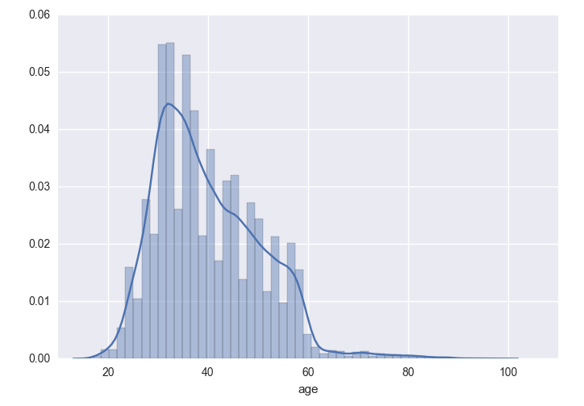
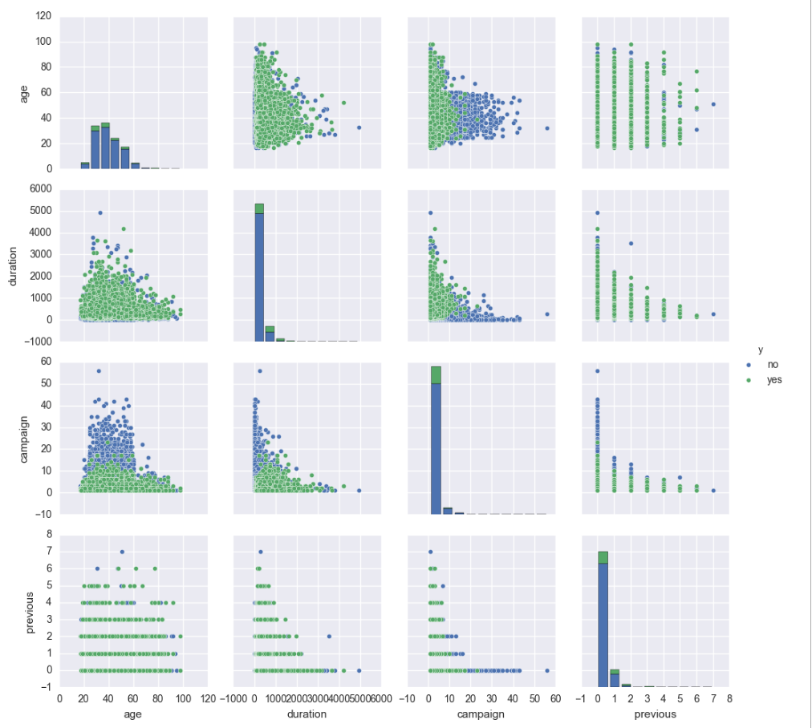
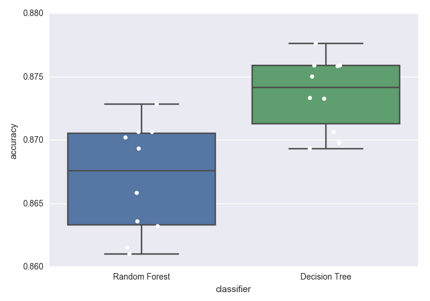
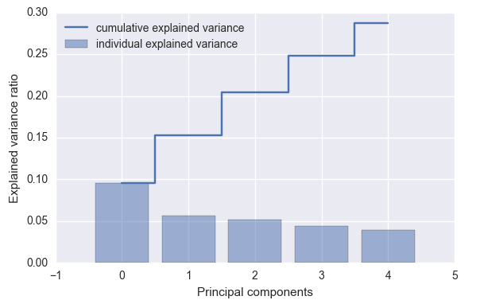
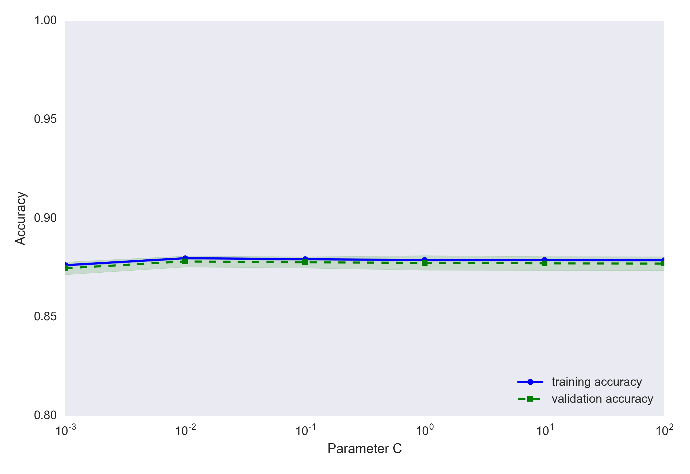

# Banking Classification Project

## Prompt

Client: **Briar's Community Bank**

We are having a campaign. We want people to subscribe to a term deposit. We have been recording our success rate on clients for a while. Can you tell us who we can convert based on their financial data?

We have their age, job, employees, their loans, if they have any credit defaults, when we called them, their education, etc., and we also recorded if our call was successful or not. What can we learn? What would be useful for us?

## Challenge

Predicting who who subscribe to a term deposit was a unique problem. The majority of the data we had was demographic or about the general economy. The bank-related data was mostly focused on loans individuals had taken out, for example, a mortgage. There was not many features related to savings account balances or investments.

Standard assumptions are that older, educated and individuals with families are more prone to savings. They have more responsibilites, more assets and more things to worry about than younger, unmarried individuals. Let's hope these can serve to help the model's predictability performance.

## Data

- 40,000+ individuals from a direct marketing campaign of a Portuguese banking institution
- It contains relevant demographic data, financial data as well economic indicators at the time of contact

## Exploratory Data Analysis

I explored various feaures. Below are a preview of the univariate and bivariate visualizations. Please check the accompany Jupyter notebooks for more detailed EDA.

**Histogram of age**

**Pair plot of quantitative variables (colored by class)**

**Box plot of Marital Status and Age (colored by class)**

## Data Preprocessing

After an inital round of EDA, I went on to engineer novel features from the data set. I thought the following may have some influence on signing up for a term deposit:

- Drop any NaNs
- Convert yes/no to 1/0
- Get dummy variables for month, day of week, job, marital status, education, type of contact
- Remove any features that have look-forward bias
- Brought features on the same scale

**Relative feature importance via Random Forest**

**Dimensionality reduction via PCA**

## Modeling

Started off with a baseline model, which had a fairly high accuracy of **87.6%**. Due to the class imbalance of a lot of No's, this makes sense. Let's see how a range of classification algorithsm compared.

**Comparing cross-validated performance**

I decided to focus on the Logistic Regression classifier and further tune it as well as examine it for over- and under-fitting.

**Validation curve**

**Confusion matrix**

It turns out my model had an incredibly low Recall at **20.5%**. In this situation, correctly identifying the "Yes" for term deposits is the most important goal of the project. If I am unable to bring Recall up to an acceptable threshold, a "highly accurate" model is pointless.

## Lessons Learned

I learned several concepts during this project. I started to examine the nuances of linear and non-linear based algorithms. I tackled the bias-variance trade-off, but will still need to further examine how to take on the precision-recall trade-off. Even though I made solid progress on the pipeline, it opened up the door for many more questions than I originally wanted to answer.

## Further Analysis

If I had more time with the project, I would complete the following tasks:

- Construct many more features dealing with interactions between 2 variables
- Explore gradient boosting
- Play with precision-recall curve

## Code Information

Feel free to browse the Jupyter notebooks in this repository. I used standard Python packages and visualization libraries. The data set is stored on [UCI's repository](https://archive.ics.uci.edu/ml/datasets/Bank+Marketing#).
