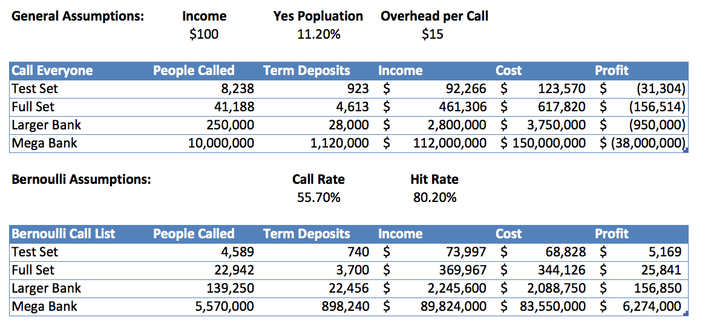

# Banking Classification Project

## Prompt

Client: **Briar's Community Bank**

We are having a campaign. We want people to subscribe to a term deposit. We have been recording our success rate on clients for a while. Can you tell us who we can convert based on their financial data?

We have their age, job, employees, their loans, if they have any credit defaults, when we called them, their education, etc., and we also recorded if our call was successful or not. What can we learn? What would be useful for us?

## Challenge

Predicting who who subscribe to a term deposit was a unique problem. The majority of the data we had was demographic or about the general economy. The bank-related data was mostly focused on loans individuals had taken out, for example, a mortgage. There was not many features related to savings account balances or investments.

Standard assumptions are that older, educated and individuals with families are more prone to savings. They have more responsibilites, more assets and more things to worry about than younger, unmarried individuals. Let's hope these can serve to help the model's predictability performance.

## Data

- 40,000+ individuals from a direct marketing campaign of a Portuguese banking institution
- It contains relevant demographic data, financial data as well economic indicators at the time of contact

## Exploratory Data Analysis

I explored various feaures. Below are a preview of the univariate and bivariate visualizations. Please check the accompanying Jupyter notebooks for more detailed EDA.

**Missing Data**

One of the first things you have to do with any dataset is examine missing data and decide on a removal or imputation strategy. At first glance, there were no NaN values when importing the CSV into pandas. However, on closer inspection, several columns had a large number of string values of "unknown". According to the data descriptions, another column had the value "999" when there was no previous call. These two columns were surely going to wreak havoc on any modeling. I decided to impute all these based on the median column values.

There seemed to be a large number of unknowns in the column designating whether the individual had credit in default. It seemed odd that the bank would not have this information on file. Maybe they did not have permission to do a credit look-up. Another possibility for so many unknowns is that this is a sensitive financial matter. People are more likely to hide the fact that they are in financial trouble vs. reporting their marital status.

**Univariate Analysis**

There were only a select few of numerical variables, while binary yes/no or multi-category. Ages in particular had a fairly normal distribution, but has a heavy right skew. There is a large drop-off at 60, almost an inverse replica to the step up from 20 to 25 on the other-end of the age spectrum.

**Multivariate Analysis**

There did not seem to be any significant relationships between the bank data. In the following correlation matrix, the warmer cells are mostly social and economic indicators released by the government. It would make sense that these numbers are highly correlated.

## Data Preprocessing

After an inital round of EDA, I went on to make sure the data was ready to be fed into any learning algorithm. These were the steps I took:

- Median imputation for 'unknown' values
- Convert yes/no to 1/0
- Get dummy variables for month, day of week, job, marital status, education, type of contact
- Remove any features that have look-forward bias
- Brought features on the same scale

**Principal Component Analysis**

I extracted out the continuous numerical variables and decided to run PCA for two reasons. I wanted to visualize the first two components as well as the first three. Also, I wanted to see if the first few components would be able to retain most of the variance.

The class highlighting on the first two principal components shows no discernable difference between individuals that signed up for term deposits and those that did not.

The cumulative explained variance does provide useful insight. If this was a heavy big data problem, we would be able to remove the last 4 components and still retain 95% of the variance. We are not memory or time constrained in this project, so we will keep the variables the way they are for now.

## First Stab at Modeling

Started off with a baseline model, which had a fairly high accuracy of **88.7%**. Due to the class imbalance of a lot of No's, this makes sense. I decided to loop through a variety of classification algorithms and see which one fared best.

**Comparing Cross-Validated Performance**

Logistic Regression and SVM seemed to fare the best, but neither vanilla implmentations are leaps and bounds beyond the baseline model.

I decided to focus on the Logistic Regression classifier and further tune it as well as examine it for over- and under-fitting.

**Validation Curve for Regularization Parameter**

Now, let's take a look and see how the predictions fare.

**Confusion Matrix**

It turns out my model had an incredibly low Recall at **20.5%**. In this situation, correctly identifying the "Yes" for term deposits is the most important goal of the project. If I am unable to bring Recall up to an acceptable threshold, a "highly accurate" model is pointless.

**Precision-Recall Curve**

Any changes to the decision threshold will crush my precision. I'll have to find an acceptable balance that makes sense for the client.

## Finalized Bernoulli Model

While reviewing the data and thinking of any additional transformations I could do, I realized the majority of my variables were binary. My linear classifiers were probably getting destroyed by the sparse high dimensional feature space. I remembered that there is a Naive Bayes classification algorithm that is meant for data distributed according to multivariate Bernoulli distributions. In essence, mulitple features but each one is assumed to be a binary-valued (Bernoulli, boolean) variable.

The decision rule for Bernoulli Naive Bayes is based on:

It explicity penalizes the non-occurence of a feature *i* that is an indicator for class *y*.

After running the default model, I had the highest starting recall of any of the models by a large margin. I decided to implement a custom threshold and here are my final results on the testing set.

## Business Value

Instead of flat-out calling 8,238 individuals, I decided that the client should call 4,589 individuals. Of this subset, we will be getting 80.4% of the individuals that would have signed up for a term deposit in the original grouping. Although the bank is missing out on 20%, the time required to get the term deposits is cut in half.

## Lessons Learned

I learned several concepts during this project. I started to examine the nuances of linear and non-linear based algorithms. I tackled the bias-variance trade-off as well as the precision-recall trade-off for the first time. Even though I made solid progress on the pipeline, I now have several more questions I do not know the answer to.

## Further Analysis

If I had more time with the project, I would complete the following tasks:

- Construct many more features dealing with interactions between 2 variables
- Explore gradient boosting

## Code Information

Feel free to browse the Jupyter notebooks in this repository. I used standard Python packages and visualization libraries. The data set is stored on [UCI's repository](https://archive.ics.uci.edu/ml/datasets/Bank+Marketing#).
