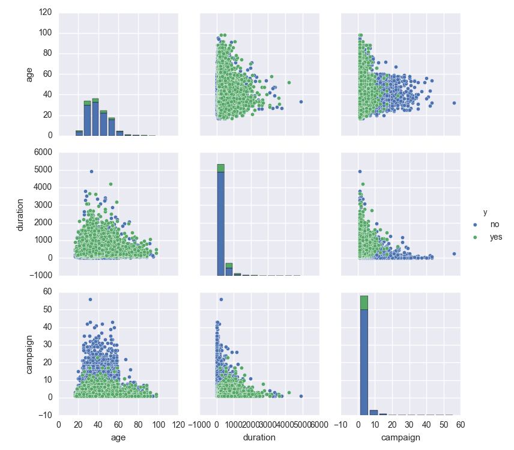
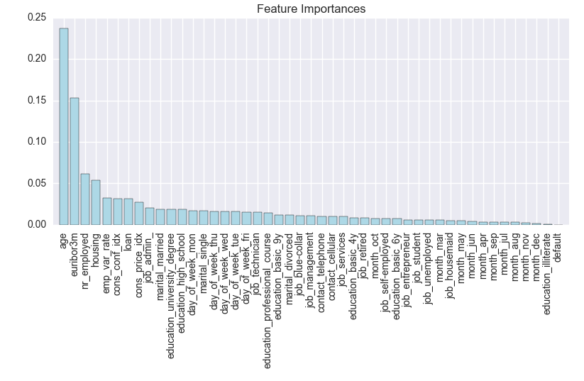

# Banking Classification Project

## Prompt

Client: **Briar's Community Bank**

We are having a campaign. We want people to subscribe to a term deposit. We have been recording our success rate on clients for a while. Can you tell us who we can convert based on their financial data?

We have their age, job, employees, their loans, if they have any credit defaults, when we called them, their education, etc., and we also recorded if our call was successful or not. What can we learn? What would be useful for us?

## Challenge

Predicting who who subscribe to a term deposit was a unique problem. The majority of the data we had was demographic or about the general economy. The bank-related data was mostly focused on loans individuals had taken out, for example, a mortgage. There was not many features related to savings account balances or investments.

Standard assumptions are that older, educated and individuals with families are more prone to savings. They have more responsibilites, more assets and more things to worry about than younger, unmarried individuals. Let's hope these can serve to help the model's predictability performance.

## Data

- 40,000+ individuals from a direct marketing campaign of a Portuguese banking institution
- It contains relevant demographic data, financial data as well economic indicators at the time of contact

## Exploratory Data Analysis

I explored various quantitative features against the Ebert Stars to see if there was a high pearson correlation coefficient.

**Pair plot of quantitative variables (colored by class)**

**Day of the week vs. Age (colored by class)**

**Box plot of Marital Status and Age (colored by class)**

**Home Ownership vs. Duration of Call (colored by previous outcome)**

## Feature Engineering

After an inital round of EDA, I went on to engineer novel features from the data set. I thought the following may have some influence on signing up for a term deposit:

- Drop any NaNs
- Get dummy variables for month, day of week, job, marital status, education, type of contact
- Remove any features that have look-forward bias

## Tree-based Methods

Decision tree classifiers are incredibly simple in theory. In their simplest form, decision tree classifiers ask a series of Yes/No questions about the data — each time getting closer to finding out the class of each entry — until they either classify the data set perfectly or simply can't differentiate a set of entries. Think of it like a game of Twenty Questions, except the computer is much, much better at it.

The nice part about decision tree classifiers is that they are scale-invariant, i.e., the scale of the features does not affect their performance, unlike many Machine Learning models. In other words, it doesn't matter if our features range from 0 to 1 or 0 to 1,000; decision tree classifiers will work with them just the same.

It's obviously a problem that our model performs quite differently depending on the subset of the data it's trained on. This phenomenon is known as overfitting: The model is learning to classify the training set so well that it doesn't generalize and perform well on data it hasn't seen before.

This problem is the main reason that most data scientists perform **k-fold cross-validation** on their models: Split the original data set into k subsets, use one of the subsets as the testing set, and the rest of the subsets are used as the training set. This process is then repeated k times such that each subset is used as the testing set exactly once.

The most common method for model parameter tuning is **Grid Search**. The idea behind Grid Search is simple: explore a range of parameters and find the best-performing parameter combination. Focus your search on the best range of parameters, then repeat this process several times until the best parameters are discovered.

**Random Forest classifiers** usually work better than individual decision trees. A common problem that decision trees face is that they're prone to overfitting: They complexify to the point that they classify the training set near-perfectly, but fail to generalize to data they have not seen before.

Random Forest classifiers work around that limitation by creating a whole bunch of decision trees (hence "forest") — each trained on random subsets of training samples (drawn with replacement) and features (drawn without replacement) — and have the decision trees work together to make a more accurate classification.

In our case, the decision tree worked better.

## Lessons Learned

I learned several concepts during this project. I had not explored tree-based methods before in-depth. I learned that although Random Forests are superior in most ways to plain Decision Trees, in this case, Decision Trees won. This was the first time I used grid search to tune hyperparameters. It was a greedy, yet effective method for finding the optimal values.

## Further Analysis

If I had more time with the project, I would complete the following tasks:

- Construct many more features dealing with interactions between 2 variables
- Reduce the dimensionality of the feature space
- Explore gradient boosting
- Compare to performance of other classification models

## Code Information

Feel free to browse the Jupyter notebooks in this repository. I used standard Python packages and visualization libraries. The data set is stored on [UCI's repository](https://archive.ics.uci.edu/ml/datasets/Bank+Marketing#).
